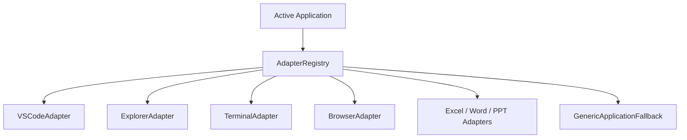

# Application Adapters & Generic Fallback — Phase 17

## 1. Adapter Architecture
The `ApplicationAdapter` interface abstracts application-specific shortcuts and semantics while providing a universal fallback for unknown programs:

---

## 2. Implemented Adapters

1. **Visual Studio Code (`VSCodeAdapter`)**:
   - `open_file`: `Ctrl+P` quick-open.
   - `open_command_palette`: `Ctrl+Shift+P`.
   - `toggle_terminal`: `Ctrl+\``.
   - `run_tests`: Launches terminal test command in editor context.

2. **Windows File Explorer (`ExplorerAdapter`)**:
   - `focus_address_bar`: `Ctrl+L`.
   - `scan_directory`: Classifies files by extension.
   - `propose_organization`: Generates preview of subfolder clustering (`Documents`, `Images`, `Archives`, `Installers`).
   - `apply_organization`: Safely executes file moves upon user confirmation.

3. **Windows Terminal & Shells (`TerminalAdapter`)**:
   - `interrupt_command`: `Ctrl+C`.
   - `clear_screen`: `Ctrl+L`.
   - `split_pane`: `Alt+Shift++`.

4. **Web Browsers (`BrowserAdapter`)**:
   - Address bar navigation, search (`Ctrl+F`), new tab (`Ctrl+T`), reload (`Ctrl+R`).

5. **Microsoft Office (`ExcelAdapter`, `PowerPointAdapter`, `WordAdapter`)**:
   - Excel: Generates workbooks with embedded charts from CSVs (`xlsxwriter`).
   - PowerPoint: Inspects slides for empty layouts and visual clutter.

6. **Generic Fallback (`GenericApplicationFallback`)**:
   - Combines UI Automation, OCR, and coordinate clicks for arbitrary desktop software.
