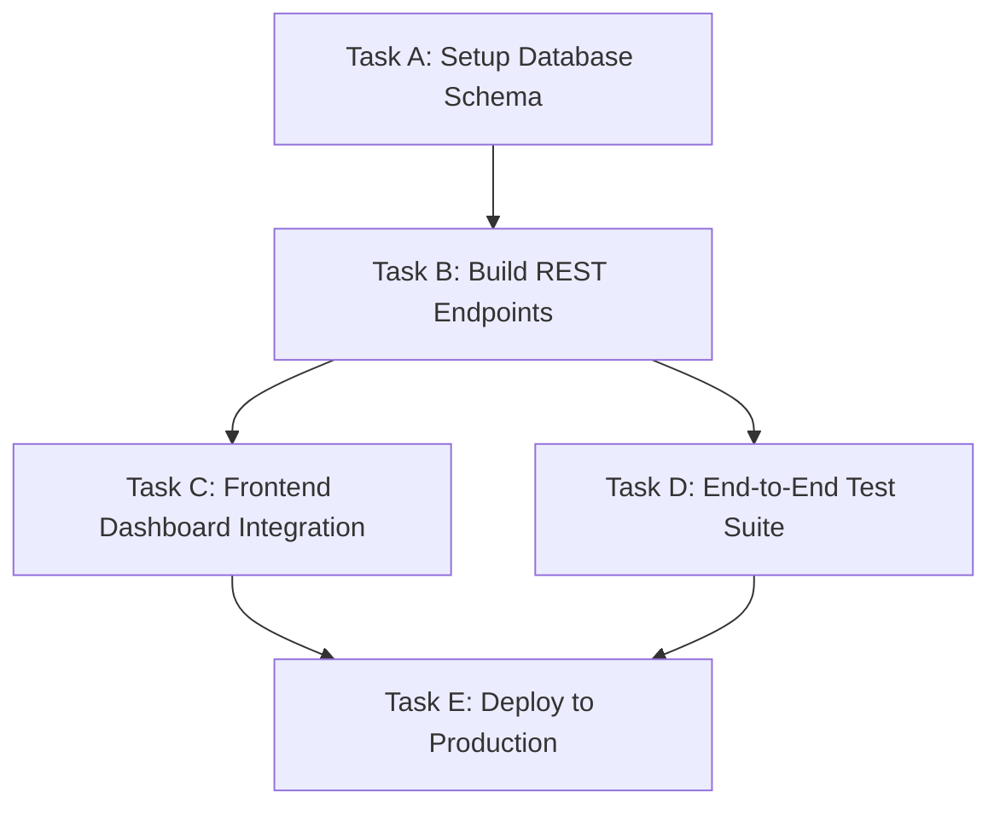

# Dependency Graphs, DAG Engine & Blocker Propagation

## 1. DAG Architecture
The `DependencyEngine` structures all task relationships as a Directed Acyclic Graph (DAG).

### Invariants Enforced
1. **No Self-Dependencies**: A task cannot depend on itself.
2. **Cycle Prevention**: Adding a dependency runs `detect_cycles(task_id, new_dependency)`. If a path already exists from `new_dependency` to `task_id`, the operation is aborted with a `CircularDependencyError`.
3. **Topological Order**: Determines the optimal serial or parallel execution order.
4. **Critical Path Calculation**: Computes the longest dependency chain by duration.

---

## 2. Blocker Propagation
- If `Task A` fails or is set to `BLOCKED`:
  - `Task B`, `Task C`, `Task D`, and `Task E` are automatically cascaded to blocked states with clear propagation explanations:
    > *"Blocked: Prerequisite 'Task A: Setup Database Schema' is blocked."*
- When `Task A` is successfully completed:
  - Downstream dependents are automatically re-evaluated, and those with all prerequisites satisfied transition back to `TODO` (ready for action).

---

## 3. Deadline Conflicts
`DeadlineEngine.detect_deadline_conflicts` monitors for inversions:
- If `Task A` has a deadline of **Friday**, but downstream dependent `Task B` has a deadline of **Thursday**:
  - Flags a `DEPENDENCY_DEADLINE_INVERSION` warning.
  - Suggests adjusting dates to preserve causal consistency.
