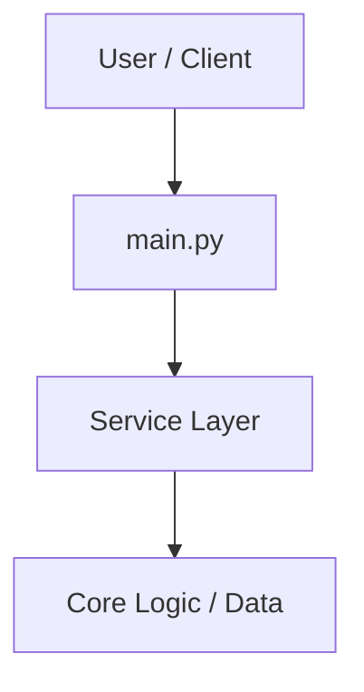

# hackathon-app

> **Tech Stack**: Python | **Frameworks**: FastAPI | **Package Manager**: pip

## Overview
Comprehensive system for Hackathon App.

## Architecture & Design
This project follows modular engineering principles, separating business logic, models, and service interfaces.



## Prerequisites & Installation
- Runtime: Python
- Package Manager: `pip`

```bash
# Install project dependencies
pip install -r requirements.txt
```

## Running the Project
```bash
uvicorn main:app --reload
```

## Running Tests
```bash
python -m unittest discover
```

## License
Proprietary & Confidential.