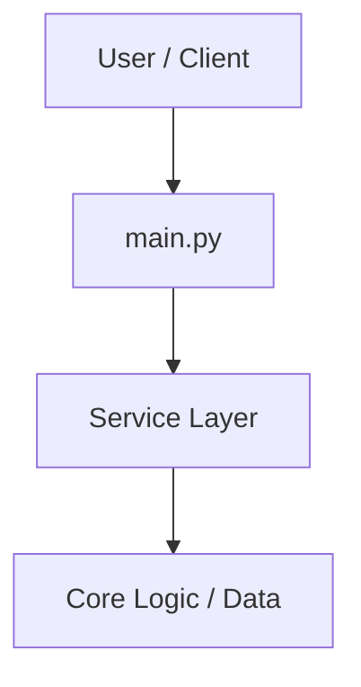

# shivani

> **Tech Stack**: Python | **Frameworks**: FastAPI | **Package Manager**: pip

## Overview
Comprehensive system for SHIVANI — Personal Autonomous AI Computer Agent.

## Architecture & Design
This project follows modular engineering principles, separating business logic, models, and service interfaces.



## Prerequisites & Installation
- Runtime: Python
- Package Manager: `pip`

```bash
# Install project dependencies
pip install -r requirements.txt
```

## Running the Project
```bash
uvicorn main:app --reload
```

## Running Tests
```bash
pytest
```

## Environment Variables
Configure the following variables in your local `.env` file:

| Variable | Description | Required |
|---|---|---|
| `ENV` | Application configuration parameter | Yes |
| `DEBUG` | Application configuration parameter | Yes |
| `PORT` | Application configuration parameter | Yes |
| `HOST` | Application configuration parameter | Yes |
| `LLM_PROVIDER` | Application configuration parameter | Yes |
| `LLM_MODEL` | Application configuration parameter | Yes |
| `GEMINI_API_KEY` | Application configuration parameter | Yes |
| `OPENAI_API_KEY` | Application configuration parameter | Yes |
| `OPENAI_BASE_URL` | Application configuration parameter | Yes |
| `SECURITY_POLICY` | Application configuration parameter | Yes |
| `AUDIT_LOG_PATH` | Application configuration parameter | Yes |
| `VOICE_ENABLED` | Application configuration parameter | Yes |
| `WAKE_WORD` | Application configuration parameter | Yes |
| `STT_PROVIDER` | Application configuration parameter | Yes |
| `TTS_PROVIDER` | Application configuration parameter | Yes |
| `BROWSER_HEADLESS` | Application configuration parameter | Yes |
| `PREFERRED_BROWSER` | Application configuration parameter | Yes |
| `MOBILE_BRIDGE_HOST` | Application configuration parameter | Yes |
| `MOBILE_BRIDGE_PORT` | Application configuration parameter | Yes |
| `MOBILE_PAIRING_SECRET` | Application configuration parameter | Yes |

## License
Proprietary & Confidential.